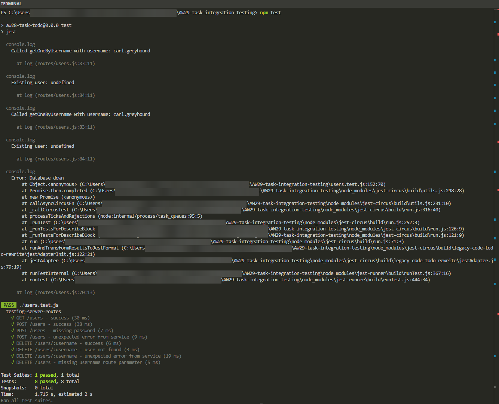

# Task: Integration Testing API

In this lesson, we learnt about integration tests.

## The Task

For this task, you must create the following API:

- The API will work with the **User** model. Each user has:
  - `username`
  - `password`
  - `score`

- Create a REST API with three endpoints:
  - `GET` (to retrieve users)
  - `POST` (to add a user)
  - `DELETE /:username` (to delete a user by username)

- Handle potential errors in your API.

- Create integration tests for each endpoint:
  - For the `POST` and `DELETE` endpoints, you must create at least **two tests each**:
    - One for a scenario where correct data is sent
    - One for when an error is thrown

To store the user data, you can either:
- Create a new database and set up the necessary connections, **or**
- Use JSON files for data storage.

# Solution
## Database setup
This application is set up using a [MySQL](https://www.mysql.com/products/community/) database, using [Sequelize](https://sequelize.org/) as an ORM layer for communication with the database. The setup requires an `.env` file to be present in the root folder of this project, with the following:
```env
ADMIN_USERNAME = <some username>
ADMIN_PASSWORD = <and the usernames password>
DATABASE_NAME = "aw29-task-integration-testing"
DIALECT = "mysql"
DIALECTMODEL = "mysql2"
PORT = "3000"
HOST = "localhost"
```

## Installing the project
[Node.js](https://nodejs.org/en) is required. 
1. In a terminal, clone the repo with `git`
2. `cd` into the project root folder
3. Install the dependencies with `npm install`

## Running the tests
4. Run the tests with `npm test`

The test results (and some logging) can be seen in the terminal:


## Running the API
5. Finally you can run the API and explore it, with `npm start`. It will be running at http://localhost:3000/users

### Bruno REST client
This project also contains a [Bruno REST client Collection](https://docs.usebruno.com/introduction/what-is-bruno) for convenience:
